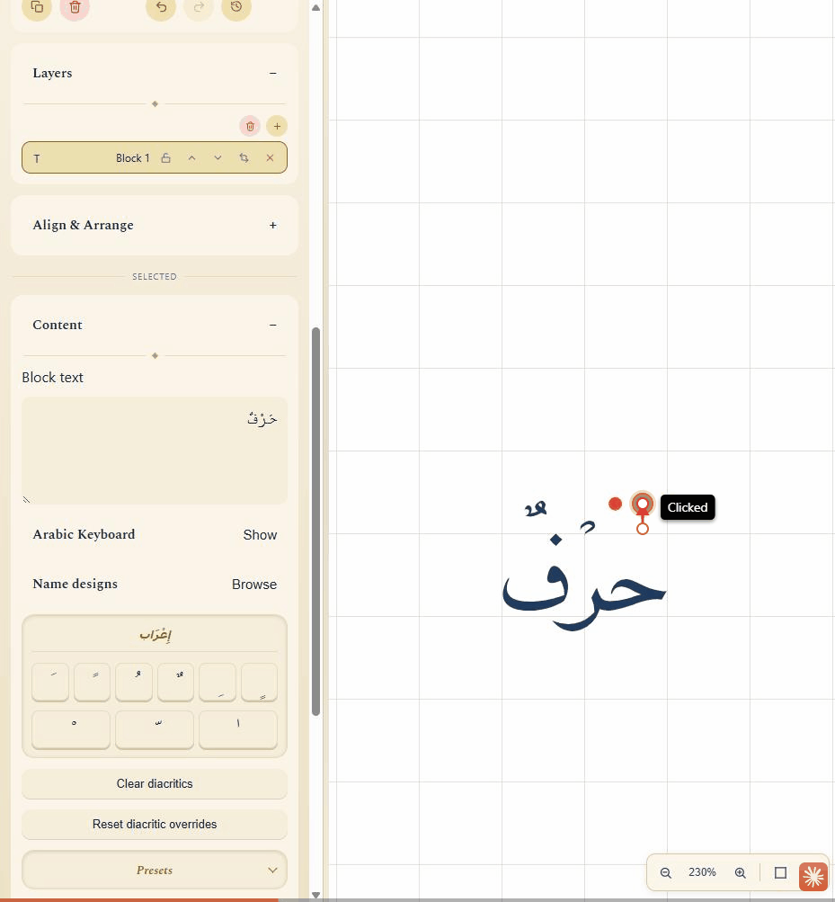
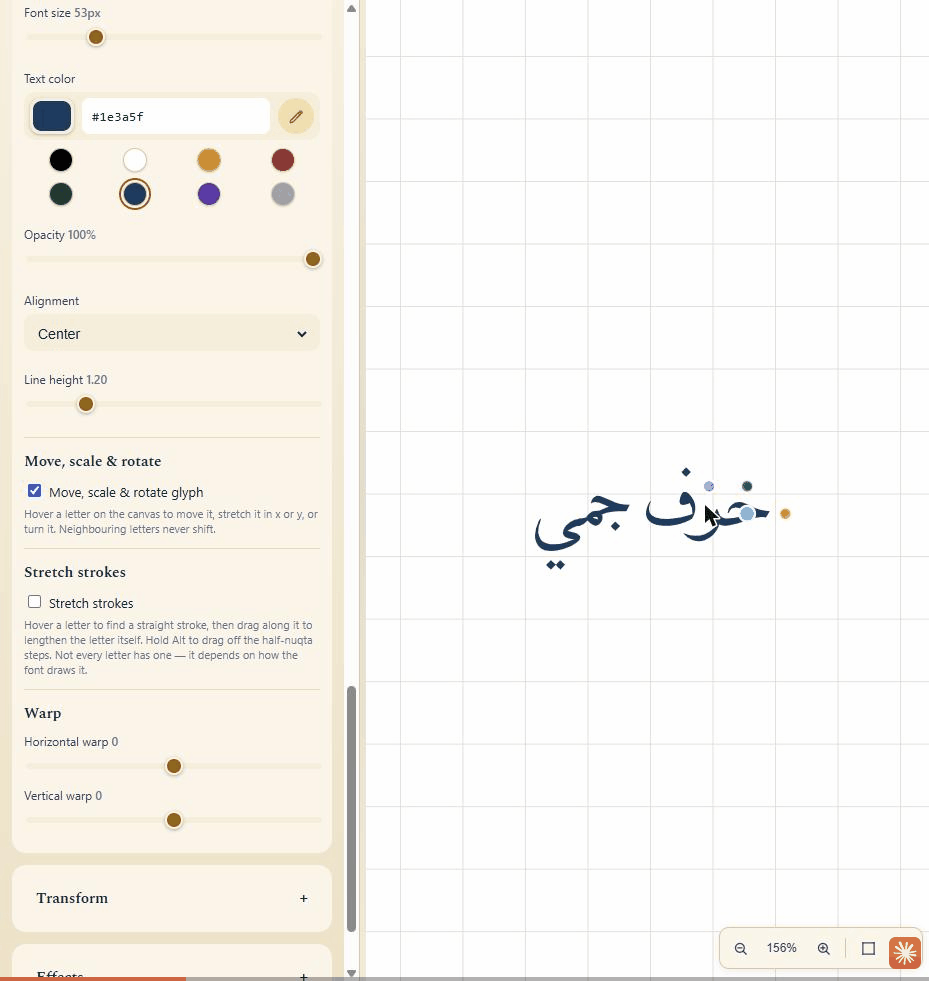

# HarfCanvas

A browser-based design tool for Arabic calligraphy.

Compose Arabic text on a canvas, flow it along a curve or pour it into a
shape, adjust individual letters and diacritics by hand, and export to PNG,
JPEG, SVG or PDF.

Text is shaped with **real HarfBuzz** compiled to WebAssembly — the same
engine your browser and operating system use — not a JavaScript
approximation. Letters connect, contextual forms are chosen by the font's
own rules, and ligatures fuse where the font says they should.

## What it does

**Typesetting**

- Arabic text shaped by HarfBuzz, rendered from real font outlines via
  [opentype.js](https://opentype.js.org/) onto a [Konva](https://konvajs.org/)
  canvas
- 17 bundled faces across Naskh, Thuluth, Kufi, Diwani, Ruq'ah, Nastaliq and
  more, plus uploading your own `.ttf`/`.otf`
- Six block types: plain text, text on an arbitrary curve, text poured into
  an SVG silhouette, square kufi woven on a grid, mirror blocks (reflection
  or radial repetition of another block, live-linked to it), and images
- An on-screen Arabic keyboard, plus one-tap insertion of harakat, honorific
  symbols and Urdu/Farsi letters

**Letter-level control** — the part that makes it a calligraphy tool rather
than a text box

- **Stretch individual strokes.** A letter's straight strokes are detected
  automatically from its own outline; drag the handle along one to lengthen
  it, in half-nuqta steps (Alt for free amounts) — the rhombic dot a reed
  nib makes, the unit traditional Arabic calligraphy actually measures in.
  Coverage varies by font and letterform; not every stroke offers a handle.
- **Kashida.** Insert real elongation (U+0640) at any legal join in a run —
  the connecting stroke is drawn at the letters' own weight, not a deformed
  outline — or hit Fit to width and let it solve the counts automatically to
  span a target.
- **Per-mark diacritic control.** Move, resize or hide any single tashkeel
  mark without touching the text underneath, on plain text and Shape Fill
  blocks alike.

  
- **Move, scale and rotate any single glyph.** Arm the tool and hover a
  letter to see its four handles — move, scale x, scale y, turn. Works on
  plain text and Shape Fill.

  

**Composition**

- **Square kufi.** Fit a run into a woven panel, paint or cut individual
  cells by hand, and lay it out as classic stacked lines or a
  boustrophedon that snakes down the panel, turning at the corner.
- **Muthanna and radial mirrors.** Reflect or repeat any block — a mirrored
  pair or an N-copy medallion — staying live as the source is edited.
- **Name designs.** See a block's text rendered in every bundled style at
  once and drop the one you like into a mirrored pair, a medallion, or a
  decorative frame.
- **Saveable text styles and colour palettes**, applied to any selection in
  one step.
- **Gradient fills** (including gold/silver/copper/lapis metallic presets)
  and generated paper textures for the page.
- **An artboard**: preset or custom page sizes, margins, and exports cropped
  to exact pixel dimensions regardless of where blocks sit.
- Multi-select, grouping, alignment and distribution
- Snapping to other blocks' edges and centres, to ruler guides, and to a
  grid, with equal-spacing hints
- Undo/redo with a visual history you can jump back into
- Starter templates with a fill-in-the-blanks wizard
- Export presets, clipboard copy, and export-all-formats in one pass
- Named projects saved locally, and optionally synced to a Supabase account

## Running it

```bash
npm install
npm run dev
```

Then open the URL Vite prints (usually <http://localhost:5173>).

```bash
npm run build    # production build
npm test         # test suite
npm run lint
```

Node 20+ recommended. No API keys or services are required — cloud sync is
optional and the app runs fully offline without it.

### Optional: cloud sync

Named projects are stored in your browser by default. To also sync them to
an account, set

```
VITE_SUPABASE_URL=...
VITE_SUPABASE_ANON_KEY=...
```

and apply the migration in `supabase/migrations/`. Without these the cloud
UI is hidden entirely and nothing else changes. Sign-in is email magic-link
only.

## Fonts and licensing

**Please read this before redistributing anything from `public/fonts/`.**

The bundled fonts come from several sources under several licences, and
**every one of them has been modified** — a set of ten honorific symbols
(ﷺ and similar) was merged into each file so those glyphs render regardless
of which face is selected. A modified font is not the upstream font, and
some licences constrain what you may then do with it.

One case is documented in full as the worked example: `HarfCanvasDiwani.ttf`
is a modified version of Layla Diwani (OFL, Mohammed Isam), renamed as the
OFL requires because the upstream reserves its name. Its licence and a note
on what changed sit beside it in `public/fonts/HarfCanvasDiwani-OFL.txt`.

The provenance of the remaining faces is **not** fully documented in this
repository. If you intend to redistribute this project or its fonts, verify
each file's licence yourself first. `scripts/FONTS.md` describes the tooling
and the obligations that come with modifying a font.

## Licence

The **source code** is MIT licensed — see [LICENSE](LICENSE).

That grant covers the code only. It explicitly does **not** cover the font
files in `public/fonts/`, which are third-party typefaces under their own
terms, as set out in the scope note at the bottom of the licence file and in
the section above.

## Project documentation

- **`CLAUDE.md`** — the engineering guide: architecture, the reasoning behind
  each subsystem, and the traps. Long, and worth reading before changing
  rendering or shaping code.
- **`PROGRESS.md`** — what shipped when, what is known-broken, and what is
  deliberately not built yet.
- **`docs/superpowers/specs/`** — design documents for individual features.
- **`scripts/FONTS.md`** — adding and measuring fonts.

## Status

Actively developed, pre-1.0, and honest about its edges — see `PROGRESS.md`
for current limitations. Built with React 19, TypeScript, Vite, Konva,
harfbuzzjs and opentype.js.
